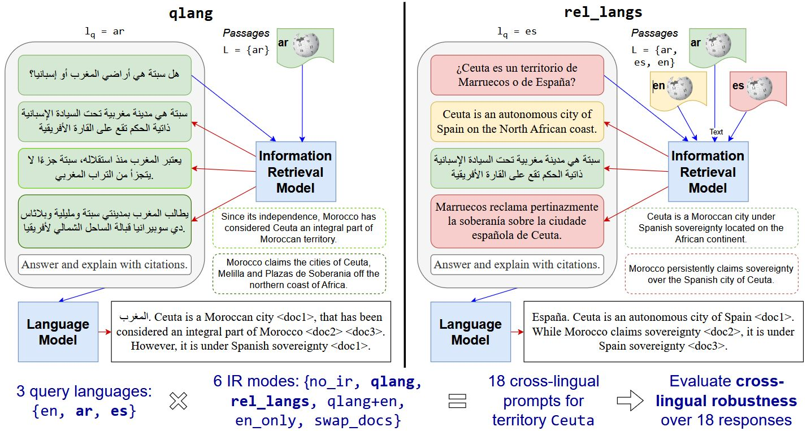

# Multilingual Retrieval Augmented Generation for Culturally-Sensitive Tasks: A Benchmark for Cross-lingual Robustness (ACL 2025 Findings)

<div align="center">

[arXiv](https://arxiv.org/abs/2410.01171)
[PDF](https://arxiv.org/pdf/2410.01171.pdf)

 



</div>

The paradigm of retrieval-augmented generated (RAG) helps mitigate hallucinations of large language models (LLMs). However, RAG also introduces biases contained within the retrieved documents. These biases can be amplified in scenarios which are multilingual and culturally-sensitive, such as territorial disputes. We thus introduce BordIRLines, a dataset of territorial disputes paired with retrieved Wikipedia documents, across 49 languages. We evaluate the cross-lingual robustness of this RAG setting by formalizing several modes for multilingual retrieval. Our experiments on several LLMs show that incorporating perspectives from diverse languages can in fact improve robustness; retrieving multilingual documents best improves response consistency and decreases geopolitical bias over RAG with purely in-language documents. We also consider how RAG responses utilize presented documents, finding a much wider variance in the linguistic distribution of response citations, when querying in low-resource languages. Our further analyses investigate the various aspects of a cross-lingual RAG pipeline, from retrieval to document contents.

# Dataset

The BordIRLines dataset is available for direct download from the [Hugging Face Hub](https://huggingface.co/datasets/borderlines/bordirlines). For detailed instructions and data card, please refer to the dataset page.

**Quick Start:**

- Examples on how to load and use the Hugging Face dataset are provided in this [Colab notebook](https://colab.research.google.com/drive/1_nHfLTOXSHcIi90acQcCKBCBIxSvqO5k?usp=sharing).

# Reproducing the Dataset

While the easiest way to use the BordIRLines dataset is via Hugging Face, we also provide scripts for reproducing the dataset from scratch. This is intended for anyone trying to run experiments on a specific part of the pipeline.

## Create Conda Environment

```
conda create -n bordirlines python=3.12
conda activate bordirlines
pip install -r requirements.txt
```

If you plan to use BGE M3 embeddings, install [Faiss](https://ai.meta.com/tools/faiss/) for your system.

## Wikipedia Data

Download our Wikipedia data from this [Drive link](https://drive.google.com/file/d/1PMoHe4eljKRyfj1Q0usMv9MdAzvcLNzK/view?usp=sharing), and store it under `bordIRlines/data`.

Alternatively, you can run the following script to recreate the Wikipedia data for each territory.

```
python get_wiki_articles.py --multi -o data/raw/wikipedia
```

## I. Run IR system over BorderLines

In this stage, we will get the top 50 most relevant paragraphs for each query, using 2 systems: OpenAI and M3-embedding.

### A. [OpenAI embeddings](https://platform.openai.com/docs/guides/embeddings)

#### 0. Save Embeddings

To not spend money generating embeddings, download our precomputed [embeddings](https://drive.google.com/file/d/1n8ygDEA-na8ZYpV40OfXPRfgKSpZqKuF/view?usp=sharing) and save them at `bordIRlines/chroma_db`.

Alternatively, to regenerate embeddings, run the command below.

```
export OPENAI_API_KEY="your_key_here"
python3 information_retrieval/ir_cache.py
```

#### 1. Retrieve most relevant documents

To retrieve the most relevant (top 50 by default) paragraphs for each query across all entities and languages, run

```
python3 information_retrieval/ir.py
```

This will save a txt file with each line formatted as: Query ID, Q0, Paragraph ID, Ranking Number, Relevance Score, Embedding Library.

*Optional*: To retrieve relevant documents for a specific entity or language, run

```
python3 information_retrieval/ir.py "Falkland Islands" en
```

### B. [BGE M3 Embedding](https://arxiv.org/abs/2402.03216)

We use M3-Embeddings, the current SOTA multilingual embedding model. This system supports all 3 paradigms of IR: sparse, dense, and multi-vector.

#### 0. Save embeddings

Save dense and sparse embeddings:

```
cd information_retrieval/
python m3_embed_ir/step0_gen_embed.py --index_save_dir m3_embed_ir/bIRl-index \
--max_passage_length 512 --batch_size 512 --fp16 --lang all
```

#### 1. Search over DBs

Dense + sparse search, get top 100 hits per query:

```
python m3_embed_ir/step1_search.py --languages all --index_save_dir m3_embed_ir/bIRl-index --result_save_dir m3_embed_ir/search_results --threads 8 --batch_size 256 --hits 100
```

#### 2. Rerank with hybrid retrieval

We combine the scores of all 3 IR functionalities. By default, equal weights are are used for sparse, dense, multi-vector.

Because multi-vector is expensive, we consider the top 50 hits from dense retrieval, then rerank them with the hybrid scores:

```
RERANK_RESULT_SAVE_DIR=m3_embed_ir/rerank_results
python m3_embed_ir/step2_rerank.py --languages all --search_result_save_dir m3_embed_ir/search_results --rerank_result_save_dir $RERANK_RESULT_SAVE_DIR --top_k 50
```

The hybrid results are in `$RERANK_RESULT_SAVE_DIR/colbert+sparse+dense/bge-m3-bge-m3/search_results.txt`.

**Reranking with different weights**
After running `step2_rerank.py`, you have not only the hybrid weights, but individual weights for `colbert`, `sparse`, and `dense`. By default, we use the suggested weights from the M3-Embedding paper `1 0.3 1`. Suppose you want to run using an equal weighting scheme:

```
python m3_embed_ir/combine_results.py --search $RERANK_RESULT_SAVE_DIR/{dense,sparse,colbert}/bge-m3-bge-m3/search_results.txt --hybrid m3_embed_ir/search_results/hybrid_results1_1_1.txt --weights 1 1 1
```

#### 3. Write to file

Finally, save the hits, with the full passage texts, to a JSON file. For the relevance annotation task, we use only the top 10 hits, so set `-n 10`:

```
# change OUT_PATH as needed
OUT_PATH=m3_embed_ir/search_results/hybrid_dense_sparse_colbert_results.json
python parse_search_results.py $RERANK_RESULT_SAVE_DIR/colbert+sparse+dense/bge-m3-bge-m3/search_results.txt -n 10 -o $OUT_PATH
```

## II. Run Generation System

In this phase, we compose queries and retrieved documents into a prompt and ask the LLM to output a territory sovereignty judgment.

### A. Pre-process Data

First, to pre-process the query data into a simple JSON format for the generation scripts, run the command below which saves results at `generation/gen_results/queries.json`:

```
python generation/parse_queries.py
```

Next, parse the document data into a simple JSON format by running:

```
cd information_retrieval
./run_dataset_parser.sh
```

As a prerequisite, you must have run the full IR system in Step I.

### B. Generate LLM Responses

To generate LLM responses for the dataset, run the following command with your desired flags. For example:

```
cd generation
python generation.py --retrieval_over qlang --llm gpt-4o-mini
```

You will need to set up LLMs without supporting APIs (e.g. LLaMA) locally before using them in the generation phase.

You can customize the generation process with the following arguments:

- `--retrieval_over`: Retrieval mode to use. Options include `qlang` (monolingual), `en` (English only), `rel_langs` (all relevant languages), and others.
- `--llm`: LLM to use for generation. Options include `gpt-4`, `mistral`, etc.
- `--citation`: If set, expects structured citations in the LLM responses.
- `--relevance_filter`: Restrict documents to only `relevant` or `non-relevant` (default: all).
- `--dry_run`: Skip actual model calls (useful for testing pipeline without incurring costs).
- `--overwrite`: Overwrite previous result files if they exist.

For a full list of arguments, run:
```
python generation/generation.py --help
```

> **Tip:** If your system has limits on the number of files that can be open simultaneously, run the following command beforehand to increase the maximum number of open files.
>
> ```
> ulimit -n 4096
> ```


### C. Citation Mode

To generate responses with structured citations (e.g. the LLM cites documents to support its territory judgment), run this bash script:

```
cd generation
./slurm_gen_cite.sh
```

# Evaluation

We also release code to reproduce the evaluations and figures done in our paper.

- To create Figures 3, 6, and 7, use the notebook:
  - `figures/figure_3_6_7.ipynb`
- To create Figure 4, 10, use the notebook:
  - `figures/figure_4_10.ipynb`
- To create Figures 15 and 16, use the notebook:
  - `figures/figure_15_16.ipynb`

# Citation

```
@article{li2025bordIRlines,
      title={Multilingual Retrieval Augmented Generation for Culturally-Sensitive Tasks: A Benchmark for Cross-lingual Robustness}, 
      author={Bryan Li and Fiona Luo and Samar Haider and Adwait Agashe and Miranda Miao and Shriya Ramakrishnan and Tammy Li and Vickie Liu and Yuan Yuan and Chris Callison-Burch},
      year={2025},
      journal={Findings of the Association for Computational Linguistics: ACL 2025},
      url={https://arxiv.org/abs/2410.01171}
}
```
